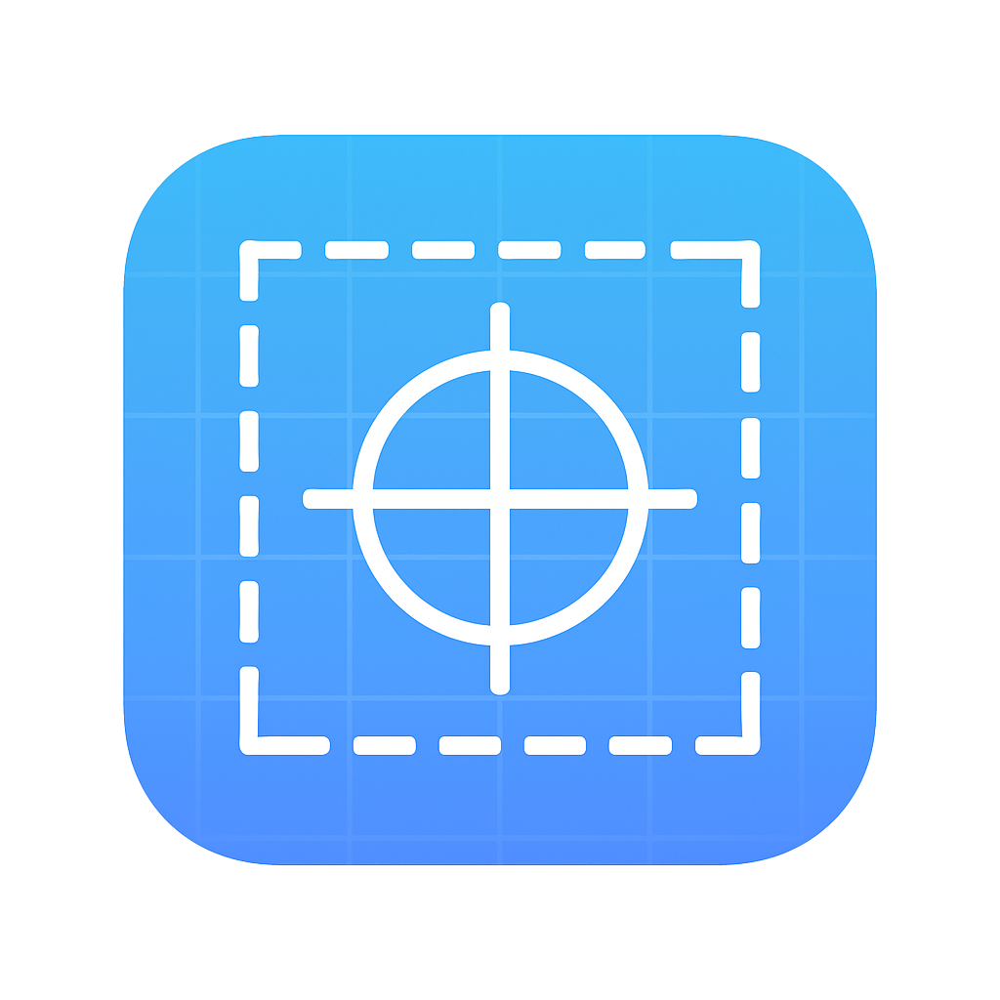

# AOI2List – USGS LiDAR AOI Tile Finder & LAZ Downloader

<p align="center">
  
</p>

**Developer:** Bill Fleming (TechBill)  
**Donations:**  
https://www.paypal.com/paypalme/techbill  
https://www.buymeacoffee.com/techbill

---

## Badges


---

## Overview

AOI2List is a cross-platform tool for locating and downloading USGS LiDAR LAZ tiles using a user-defined Area of Interest (AOI).  
It includes both a command-line interface (CLI) and a graphical interface (GUI) with tile selection, filtering, and a multithreaded download engine.

AOI2List now provides **native executables** for both **Windows** and **macOS**.

---

## Features

- AOI-based search for USGS LiDAR LAZ tiles  
- CLI (`aoi2list.py`) and GUI (`aoi2list_gui.py`)  
- Tile sorting and metadata extraction  
- Tile selection interface in GUI  
- Save selected URLs to file  
- Multithreaded downloader with:
  - Progress bar  
  - Download speed  
  - Retry logic  
  - Cancel button  
- **Native Windows `.exe` build** (standalone)  
- **macOS `.app` bundle** with custom icon  
- Cross-platform Python source included  
- Requires only Python + Tkinter when running from source

---

## Project Structure

```
src/
    aoi2list.py
    aoi2list_gui.py

assets/
    AOI2List.ico
    AOI2List.icns
    icon_preview.png

requirements.txt
LICENSE
README.md
```

---

## Installation (Source Version)

Install dependencies:

```bash
pip install -r requirements.txt
```

Required dependency:

```
requests>=2.0
```

Tkinter is included with Python on macOS and Windows.

---

## CLI Usage

```bash
python src/aoi2list.py --lat 37.1 --lon -92.6 --sqmi 6 --out output.txt
```

---

## GUI Usage

```bash
python src/aoi2list_gui.py
```

---

## Windows Executable Build

```cmd
pyinstaller --onefile --windowed --name AOI2List --icon=assets\AOI2List.ico src\aoi2list_gui.py
```

Output:

```
dist\AOI2List.exe
```

---

## macOS Application Build

```bash
python3 -m PyInstaller --clean --windowed --icon assets/AOI2List.icns --name AOI2List src/aoi2list_gui.py
```

Output:

```
dist/AOI2List.app
```

---

## License

This project is licensed under a custom **non-commercial license**.  
Personal and educational use is allowed.  
Commercial use requires permission.

See `LICENSE` for full details.

---

## Support / Contact

For issues or suggestions:  
`billyjackrootbeer (at sign) gmail (dot) com`

If this tool helps you, consider donating:  
https://www.paypal.com/paypalme/techbill  
https://www.buymeacoffee.com/techbill
