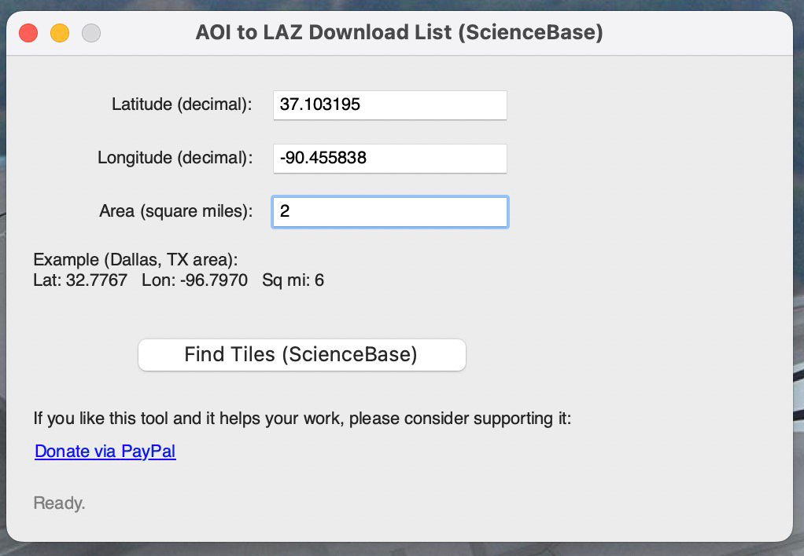
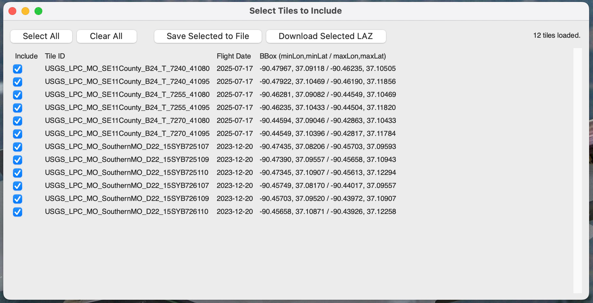

# AOI2List – USGS LiDAR AOI Tile Finder & LAZ Downloader

<p align="center">
  
</p>

**Developer:** Bill Fleming (TechBill)  
**Contact:** `billyjackrootbeer (at sign) gmail (dot) com`  
**Donations:** https://www.paypal.com/paypalme/techbill  
               https://www.buymeacoffee.com/techbill
              

---

## Badges


---

## Overview

AOI2List is a cross-platform tool for locating and downloading USGS LiDAR LAZ tiles using a user-defined Area of Interest (AOI).  
It includes a command-line interface (CLI) and a full graphical interface (GUI) with tile selection and a multithreaded downloader.

---

## Features

- AOI-based search for USGS LiDAR LAZ tiles  
- CLI (`aoi2list.py`) and GUI (`aoi2list_gui.py`)  
- Tile sorting and metadata extraction  
- Tile selection window in GUI  
- Save selected LAZ URLs to text file  
- Multi-file threaded downloader with:
  - Progress bar  
  - Download speed display  
  - Retry logic  
  - Cancel button  
- Fully packaged macOS `.app` bundle  
- Custom icon and bundle metadata via PyInstaller

---

## Screenshots






---

## Project Structure

```
src/
    aoi2list.py
    aoi2list_gui.py

assets/
    AOI2List.icns
    icon_preview.png
    (optional screenshots)

AOI2List.spec
LICENSE
README.md
requirements.txt
```

---

## Installation

Install Python dependencies:

```bash
python3 -m pip install -r requirements.txt
```

Only dependency needed:

```
requests>=2.0
```

Tkinter is included with Python on macOS and Windows.

---

## CLI Usage

```bash
python3 src/aoi2list.py --lat 37.1 --lon -92.6 --sqmi 6 --out output.txt
```

---

## GUI Usage

```bash
python3 src/aoi2list_gui.py
```

---

## macOS Application Build

### Using PyInstaller (simple method)

```bash
python3 -m PyInstaller --clean --windowed     --icon assets/AOI2List.icns     --name AOI2List     src/aoi2list_gui.py
```

Output appears in:

```
dist/AOI2List.app
```

### Recommended Metadata Build (using .spec)

```bash
python3 -m PyInstaller --clean AOI2List.spec
```

This includes:

- App version  
- Bundle ID  
- Author metadata  
- Icon embedding  
- Fully populated Info.plist  

---

## macOS App First Run

If macOS warns about an unidentified developer:

1. Right-click the app  
2. Select **Open**  
3. Click **Open** again  

This needs to be done **only once**.

---

## License

This project is licensed under a custom **non-commercial license**.  
Personal and educational use is allowed.  
Commercial use requires permission from the developer.  

See `LICENSE` for full text.

---

## Support / Contact

For issues or suggestions:  
`billyjackrootbeer (at sign) gmail (dot) com`

If this tool helps you, consider donating:  
https://www.paypal.com/paypalme/techbill
